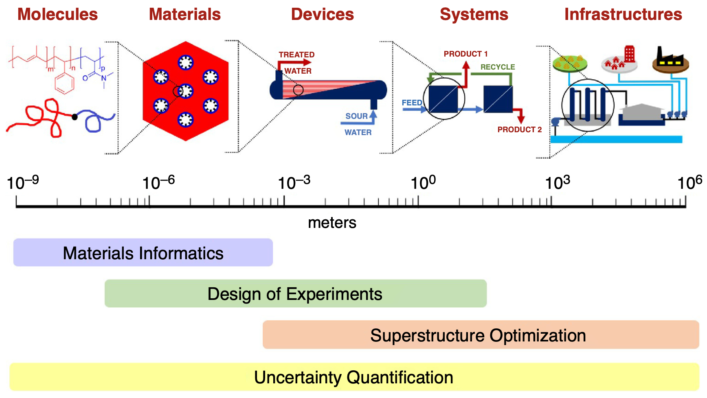

I am a computational scientist and chemical engineer who enjoys leveraging data to make better decisions and accelerate workflows through automation. I am adept at Python having worked with it for the past 9 years. Prior to that I worked as a Process Engineer designing and building chemical plants. In my ideal job, I will use AI/ML for data analytivs to accelarate industrial design, construction, and commissioning, as this combines all the experience I have gained in my career.

Here's my [resume](pages/resume.md) and my [CV.](pages/cv.md)

## Research areas:

In my research, I dove into data-driven methods to accelerate process design, development, and engineering. I leveraged techniques in mathematical modeling, nonlinear optimization, nonlinear parameter estimation, machine learning, and Bayesian inference in my work. My publications/research profile can be viewed on my CV, Google Scholar, or ORCID.

[Google Scholar](https://scholar.google.com/citations?user=RCvn620AAAAJ&hl=en&oi=ao) | [ORCID](https://orcid.org/0000-0003-2996-7031) | 

